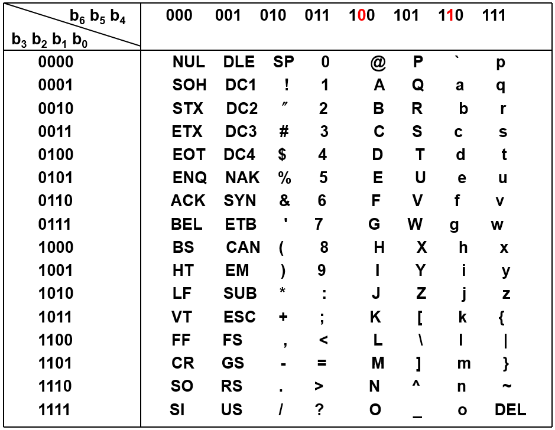

## 常用进制

> 二进制(B, binary)，八进制(O, octal)，十进制(D, decimal)，十六进制(H, hexadecimal)。

## 进制转化

>  从二进制到十进制通常都是用对应位的数乘以其对应的权再直接求和，同样，十六进制到十进制的转化也是通过权重来计算，比如：
>  $$
>  BF3CH=11*16^3+15*16^2+3*16^1+12*16^0=...D
>  $$
>  
>
>  而二进制与十六进制通常通过对照表进行转化。

#### 十进制到二进制

- 降幂法：先写出小于十进制数的所有二进制的权，然后不断用最接近十进制数的二进制权值减十进制数，直到为0

  | 32   | 16   | 8    | 4    | 2    | 1    |
  | ---- | ---- | ---- | ---- | ---- | ---- |
  | 1    | 1    | 0    | 1    | 0    | 1    |

  计算过程:
  $$
  \begin{split}
  53-2^5&=21\\
  21-2^4&=5\\
  &...\\
  1-2^0&=0
  \end{split}
  $$
  小数也是如此

  | 0.5  | 0.25 | 0.125 | 0.0625 |
  | ---- | ---- | ----- | ------ |
  | 1    | 1    | 0     | 1      |

  ....

- 除法：二进制数如果是整数，不断除以二，得到余数部分，直到商为0。如果是定点小数，不断乘以2，直到小数部分为0，比如：0.8125D=0.1101B。
  $$
  \begin{split}
  0.8125*2=1.625&...b_1=1\\
  0.625*2=1.25&...b_2=1\\
  0.25*2=0.5&...b_3=0\\
  0.5*2=1.0&...b_4=1\\
  \end{split}
  $$
  

#### 十进制到十六进制

- 降幂法：比如48956D

  | 4096 | 256  | 16   | 1    |
  | ---- | ---- | ---- | ---- |
  | B    | F    | 3    | C    |

  $$
  \begin{split}
  4895-11*4096&=3900\\
  &...\\
  12-12*1&=0\\
  \end{split}
  $$

- 除法：不断除以16，取余数，直到为0，对于定点小数也是同样处理

## 定点数和浮点数的表示

> 参考计算机组成原理的笔记。定点数部分 可以记忆为一张表原码，反码，补码，移码。

## 运算

> 同样参考计算机组成原理

## ASCII码

​	记住几个重要的：

| 字符    | 十六进制 |
| ------- | -------- |
| LF 换行 | 0A       |
| FF 回车 | 0B       |
| SP 空格 | 20       |
| , 逗号  | 2C       |
| . 句号  | 2E       |
| 0 零    | 30       |
| A       | 41       |
| a       | 61       |

