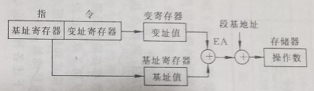

# 基本概念

## 历史

> 计算机是由：运算器、控制器、存储器和输入输出设备构成

- 0x86是Intel公司生产的微处理器系列。

-  Intel公司成立于1968年，1969年设计出了4位微处理器4004，73年开发出8位微处理器8080。

- 1978年正式推出16位微处理器8086，开始了Intel公司的80x86微处理器系列的生产历史。

- 尤其值得指出的是，在推出8086后，Intel推出了与8086内部结构基本相同，但外部接口为8位的8088CPU，并得到了“蓝色巨人”IBM的采用，从此，开创了Intel的新天地。
- 20世纪70年代初开始，随着大规模集成电路技术的发展，已经开始将运算器、控制器集成到一个芯片上，构成了中央处理器（或称中央处理单元，即CPU）。
- 80x86微处理器的发展参见 表2.1 (P15) 。
- 协处理器：浮点运算处理器。
- 工作方式：从286开始，有：**实模式和保护模式**，在保护模式下，机器可以提供虚拟存储管理和多任务管理机制。从80386开始，增加了虚86工作模式，一台机器可以**模拟**多个8086处理器工作，进一步提高了处理器的可用性。（**虚拟化？？**）

# 系统结构

- 硬件

  ​	采用6086CPU，机器字长16位，数据线16根，地址线20根，1M RAM， 40K ROM(BIOS)

  

- 软件

  ​	系统软件

  |           | 功能                                   |
  | --------- | -------------------------------------- |
  | MASK.EXE  | 汇编器，用于汇编的程序，M表示microsoft |
  | LINK.EXE  | 链接器                                 |
  | DEBUG.EXE | 用于debug，能够看到内存中的数据        |

  ​	用户软件：多行文本编辑器

## CPU

> CPU的结构看组成原理

### 寄存器组

> 分为三大类：通用寄存器，专用寄存器，段寄存器。在实验环境中，这些寄存器都是16位字长


### 通用寄存器

| 寄存器          |                                                    |
| --------------- | -------------------------------------------------- |
| AX(accumulator) | 通常作为累加器，存放操作数，IO指令通常用它做缓存   |
| BX(base)        | 常做基址变址                                       |
| CX(count)       | 常用于计数，比如循环                               |
| DX(data)        | 双字长运算常用于和AX一起存数，IO操作常用于存放端口 |

上面这四个寄存器可以分为高位和低位，一次使用一个字节。

BP和SP与段寄存器SS用来确定堆栈的某一存储单元。

SI和DI与数据段寄存器DS结合，用来分别指向数据段中的源操作数和目标操作数。

### 专用寄存器

IP：指令指针寄存器，用于存放执行代码的偏移。**在程序运行过程中，始终指向下一条指令的首地址**(和CS联用)，可以用于控制程序的运行流程(跳转等)

SP：(所以SP到底是通用的还是专用的...通用吧...)和SS一起确定当前堆栈段中栈顶的地址

FLAG(or PSW)：程序状态寄存器


TF，陷阱标志，对应于(操作系统导论中提到的)trap指令，会将CPU转移给OS。

在实际Debug时，上面给出的标志位并不是0/1，而是类似宏定义


### 段寄存器

​		段地址寄存器存放了实模式分段中小段的首地址，关于分段的说明在下面存储器部分

​	CS：代码段地址寄存器，不能在用户程序中直接修改

​	DS：数据段地址寄存器

​	ES：扩展段地址寄存器

​	SS：堆栈段地址寄存器


## 存储器

> 存储器通常是以字节为单位进行存储，每个字节会有唯一的编号，即物理地址，通常是线性增长的。

### 偶地址访问

​	字：不同计算机字长可能不同，16位，32位，64位...存储器中字单元通常是由这个字存储的所有字节的物理地址中的低地址表示。

​	计算机存储的时候通常都是低字节存低位，高字节存高位，所以像是0110 1001B这样的数，字地址是1001存放的地址。

​	计算机访问数据的时候都是以字为单位访问的，即访问偶地址，所以像下面，如果要访问奇地址开始的两个字节，需要两次访存操作


### 实模式寻址

> 意义：解决用16位字长访问1M存储(地址总线为20位)

#### 分段访问

​	用两个字来表示一个地址，可以分成2^16^段，这样每段只有16个字，但是由于有另外16个bit，所以偏移量是可以达到64K的

注意：**段的起始地址必须是某小段的首地址**


  **物理地址**：每个存储单元的唯一的20位地址

  **段地址**：段起始地址的高16位

  **偏移地址**：段内相对于段起始地址的偏移值（16位）(*有效地址*EA)  


## 外部设备

​	外部设备与主机（CPU和存储器）的通信是通过外设接口（Interface）

- 数据寄存器：存放外设和主机间传送的数据。
- 状态寄存器：保存外设或接口的状态信息。
- 命令寄存器：保存CPU发给外设或接口的控制命令。

# 指令系统

## 寻址方式

​	80x86的指令集在课本附录。指令格式：
$$
操作码 <操作数> ... <操作数>
$$
其中**操作数部分给出的都是地址**，会有不同数目的操作数(0, 1, 2, 3)，寻址通常分为两种：

- 和数据有关的寻址(数据段)
- 和转移地址有关的寻址(代码段)

### 和数据有关的寻址

#### 立即寻址

​	操作数会直接在指令中给出，就像代码中直接使用的宏或者常数，这种方式，**数据会保存在代码段中**
$$
MOV \ AL,5\\
MOV \ AX,3064H
$$
​	第一条指令执行后，(AL)=05H。这里有一点要注意，关于数值的存入，一定要确保目标和源的字长是一致的。

#### 寄存器寻址方式

​	操作数存放在指定的寄存器中，这种方式不需要访问存储器，因此速度比较快。
$$
MOV\ AX,BX\\
MOV\ AL,BH
$$


> 1. 有效地址(EA, effective address): 操作数的偏移地址
>
> $$
> EA = 基址+(变址×比例因子)+位移量
> $$
>
> - 位移量
> - 基址：存放在基址寄存器，比如像是数组的首地址
> - 变址：存放在变址寄存器，比如数组中某元素(第几个)
> - 比例因子：386开始才有
>
> 2. 物理地址(PA): 以8086中的数据段为例，其他段寄存器类似
>
> $$
> PA = 1H×(DS)+EA
> $$
> 3. 寻址方式命名
>
>    ​	在下面的寻址方式中主要区别就是有效地址的产生来自三个分量中的几个。只有位移量的称为“直接”，因为可以看成“直接”给出了地址具体值，但是之后给出位移量的时候转移方式会带有“相对”，这时候可以理解成“相对”基址或者变址给出的地址有了位移。
>
>    ​	寄存器间接寻址的“间接”是因为这种方式下寄存器保存的是地址，寄存器寻址保存的是操作数。

#### 直接寻址方式

​	操作数的EA在代码段中给出，而且只有位移量，比如：
$$
MOV\ AX,\ [2000H]
$$
如果(DS)=3000H，则执行指令后会将PA=32000H的数据存储到AX中。在这里[2000H]可以看成取出EA=2000H位置的数

> 在实验中，操作数的地址可以用变量指定，这里的变量也只是符号地址，区别于高级语言中的变量，比如:
> $$
> VALUE\ DB\ 10\\
> ...\\
> MOV\ AH,\ [VALUE]
> $$

这里还可以使用段跨越前缀：指定基址为(ES)
$$
MOV\ AX,\ ES:[2000H]
$$

#### 寄存器间接寻址

​	[AX]的用法应该看成取出寄存器里面的值。

​	相比直接寻址，只是将原本在代码中给出的地址换为存储在寄存器中，即操作数的EA在代码段中给出，而且只有基址或变址。EA存储于基址寄存器(BX/BP)或变址寄存器(SI/DI)，这里要注意一下，这几个寄存器对应的段寄存器地址是不一样的：


​	不过段寄存器可以通过前面的段跨越前缀来指定。切记，这里可以用BX，但是AX, CX, DX都不能用。
$$
\begin{split}
MOV \ AX,\ [BX]& \ \ \ \ \ PA = 16d × (DS) + (BX)\\
MOV \ AX,\ ES:[BX]& \ \ \ \ \ PA = 16d × (ES) + (BX)\\
MOV \ AX,\ [BP]& \ \ \ \ \ PA = 16d × (SS) + (BP)
\end{split}
$$


#### 寄存器相对寻址

​	有效地址由两部分组成，基址(BX/BP)或者变址(SI/DI)(只能有其中一个)加位移量。其中位移量通常由变量直接指定


$$
MOV\ AX,\ COUNT[SI]\\
MOV\ AX,\ [COUNT+SI]
$$
​	其中COUNT为位移量，SI为变址


#### 基址变址寻址

​	有效地址由两部分组成，基址(BX/BP)和变址(SI/DI)，这个时候请注意BP的使用


$$
MOV\ AX,\ [BX][DI]\\
MOV\ AX,\ [BX+DI]\\
MOV\ AX,\ ES:[BX][SI]
$$

#### 相对基址变址寻址

​	有效地址由三部分一起组成


$$
MOV\ AX,\ MASK[BX][DI]\\
MOV\ AX,\ MASK[BX+DI]\\
MOV\ AX,\ [MASK+BX+SI]\\
MOV\ AX,\ MASK[BP][SI]
$$
​	最后这个指令是相对于堆栈段(SS)的地址

后面这几种方式比较适合循环，字符串，表格之类的场景

### 和指令有关的寻址 -- 转移地址

​	和转移地址有关的寻址方式可以分为段内和段间，实模式下寻址，由于IP最多给出16位，即64k的寻址空间，因此至少在程序大于64k的时候一定会出现分段，当然也存在其他需要分段的情况，对于段间寻址的方式，(CS)是需要变化的

#### 段内直接寻址

​	使用JMP指令：类似goto


​	JMP执行机制是通过向IP加上偏移实现的跳转，有近跳转和短跳转，默认情况是短跳转。注意，下面给出的范围是字节，不是指令条数。**然后注意：指令中跳转的距离是用补码表示的，参考下面题目**

```shell
JMP NEAR PTR NEXT  近转移    -32768 ~ +32767
JMP SHORT    NEXT  短转移      -128 ~ +127  
```


#### 段内间接寻址

​	**转向的有效地址EA是一个寄存器或存储单元的内容**，因此可以使用前面数据寻址中提到的除了立即数寻址方式的其他所有方式


## 指令系统

对于每条指令，应当关注：

- 指令的基本功能
- 执行后对标志位的影响
- 对寻址方式或寄存器使用的限制和隐含使用的情况

### tricks

```shell
# 清零操作，可以避免出现立即数
SUB AX, AX
```


