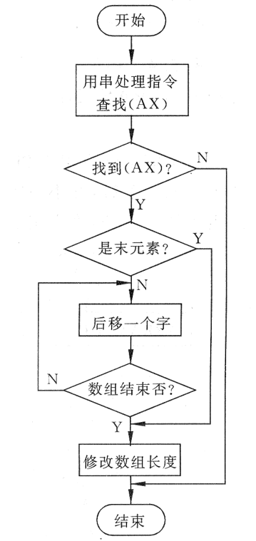
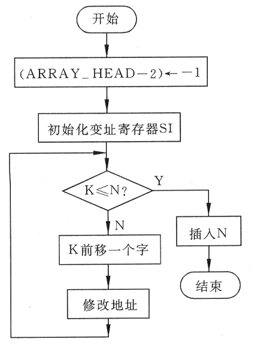

### 程序结构

#### 结构体

```assembly
; label字段可以去掉
stockM  label   byte
        max1    db      40			; 最大存储长度，16进制
        len1    db      ?			; 实际输入长度
        strM    db      40 dup(?)	; 存储位置
; 注意实际输入长度为字节
; 存储位置的使用可以当作字符串首地址
```

### 函数

#### io

```assembly
; 输入输出在调用前都得设置dx
; 虽然可以通过传参的形式，但是同样需要用到寄存器(保存取出的参数)，而且花销更大
input	proc	near
		push    ax		;使用stack保存，调用前后保证不影响寄存器
        mov     ah,0ah
        int     21h
        pop     ax
        ret
; 调用output，dx应该存储结构体名称
output  proc    near
        push    ax
        mov     ah,09
        int     21h
        pop     ax
        ret
; 例子：输出换行回车，在输入后应当及时换行回车，否则可能会覆盖输入
Mess0   db      13,10,'$'
nxLn    proc    near
        push    dx
        lea     dx,Mess0
        call    output
        pop     dx
        ret
```

### 循环

#### 特殊循环

```assembly
; 串查找指令提供了一些特殊的循环
; 例子：在附加段中，有一个首地址为LIST的未经排序的字数组。在数组的第一个字中，存放着该数组的长度，数组的首地址已经存放在DI寄存器中，AX寄存器中存放着一个数。要求在数组中查找该数，如果找到将其从数组中删除
```



```assembly
    mov		ax,num	; num to find-and-delete
    cld
    push 	di		; save di
	mov		cx,es:[di]	; 注意在es段
	add		di,2		; begining of array
	repne	scasw		; word wise
	je		delete		; found
						; no found
	pop		di			; recover
	jmp		short exit
delete:
	jcxz	dec_cnt
sft_elem:
	mov		bx,es:[di]
	mov		es:[di-2],bx
	add		di,2
	loop	sft_elem	; 隐式使用了cx
dec_cnt:
	pop		di
	dec		word ptr es:[di]	; 注意指定类型
exit:
	ret
```

**倒序循环**

```assembly
; 将正数N插入一个已整序的字数组的正确位置。该数组的首地址＆末地址分别为ARRAY_HEAD和ARRAY_END，其中所有数均为正数且已按递增的次序排列
; 
```



```assembly
; 像上面的设计，要求数组前方留下一个空位
x			dw	?
arr_head	dw	xxxx
```


#### 条件循环

```assembly
; 在ADDR单元中存放着数Y的地址，试编制一程序把Y中的1的个数存入COUNT单元中
	mov		bx,addr
	mov		ax,[bx]
	sub		cx,cx
rep:
	test	ax,0ffffH
	jz		exit
	jns		sft
	inc		cx
sft:
	shl		ax,1
	jmp		rep
exit:
	mov		count,cx
```

#### 多重循环

```assembly
; 多重循环虽然能利用多个寄存器自己实现，但是
; 不但浪费寄存器，还不易于管理，可以利用stcak实现
	mov cx,<n1>
tag1:
	...
	push cx
	mov	 cx, <n1>
;------------
tag2:
	...
	loop tag2
;------------
	...
	pop  cx
	loop tag1
; 应当注意，串处理指令会影响cx
```

### 输出格式

#### 将数字输出为十进制

#### 输出为十六进制

将bx中的数据输出为16进制。

1. 循环左移四位，然后将低四位表示的十六进制输出
2. 对于一个四位的数据，判断其是否大于9，从而转化为0-9或A-F

实现的时候如果用loop，需要cx，位移指令需要cl，需要解决冲突，比较好的方法是使用ch自己实现循环

### 分支结构

#### 逻辑尺

```assembly
logic_rule	dw	11011100B
	
	mov	dx,logic_rule
	...
next:
	shr	dx,1		; 利用逻辑尺中的位对循环中定制不同的操作
	jc	case2
case1:
	...
	jmp	xxx
case2:
	...
	jmp	xxx
```

