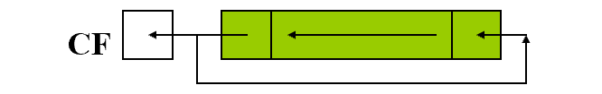

# 80x86指令系统

## 数据传送指令

## 算术指令

### 1.加法

```assembly
add dst,src	
; (dst) = (src) + (dst)
adc dst,src
; (dst) = (src) + (dst) + CF
inc opr
; (opr) = (opr) + 1
```

​	*inc*指令不影响标志位，另外两条都会影响。

| 标志位 |                                    |
| ------ | ---------------------------------- |
| SF     | 结果为负 - 1                       |
| ZF     | 结果为0 - 1                        |
| CF     | 求和后最高有效位有进位 - 1         |
| OF     | 两个操作数符合相同，而结果符号相反 |

​	在这里，CF可以作为无符号数相加的溢出，而OF表示带符号数相加的溢出

> 对机器来说不存在有没有符号

**溢出**


​	对于有无符号溢出的理解：8位二进制数可以表示无符号的0-255，而有符号则是-128-127，有符号数通过补码表示，首位为1的为负数，对应了无符号数128-255的数字。当两个0-128数字相加，是不会产生无符号数溢出的，但是可能结果大于128，首位为1，于是理解为无符号数的时候属于溢出。当一个较小的负数和一个正数相加，理解成有符号数的时候不可能溢出，但是理解成无符号数的时候由于较小负数对应的是较大的无符号正数，所以可能溢出

**双精度加法**

> 所谓双精度是指：用两个字表示一个数字

​	把两个数字分别存储为((DX), (AX))和((BX), (CX))，低位用ADD，高位用ADC。

```assembly
add ax,cx
adc dx,bx
```

> 习惯这样用的原因是，拓展字长的指令CBW，CWD会将AL拓展到AX或AX拓展到((DX), (AX))

### 2.减法

```assembly
sub dst,src
; (dst) = (dst) - (src)
sbb dst, src
; (dst) = (dst) - (src) - CF
dec	opr
; (opr) = (opr) - 1
neg opr
; (opr) = -(opr) 即求补，按位取反加1
cmp	opr1,opr2
; (opr1) - (opr2) 会影响标志位
```

​	除了*dec*都会影响标志位，SF和ZF和加法一样，而CF，OF同样表示无符号和有符号的溢出

| 标志位 |                                            |
| ------ | ------------------------------------------ |
| CF     | 被减数的最高有效位有向高位借位             |
| OF     | 两个操作数符号相反，而结果的符号和减数相同 |

*neg*：求补即理解成0-opr，因此只有操作数为0的时候CF=0。而OF位只有当操作数位-128(全0)时为1

### 3.乘法

​	乘法和除法运算都有一个默认的操作数位置，可能是由于运算后结果长度会发生变化，所以没有让指令给出所有操作数

**无符号数乘法**

```assembly
mul src
; (AX) = (AL) * (SRC)
; (DX, AX) = (AX) * (SRC)
```

​	具体执行字节还是字取决于SRC的长度

**有符号数乘法**

```assembly
imul src
; 同上
```

​	SRC不能为立即数，不然都不知道长度，对除OF，CF的影响无定义


### 4.除法指令

​	被除数的长度是除数的两倍，字/字节=字节 =>可能导致溢出

```assembly
div	src		; 无符号
idiv src	; 有符号
; 字节：
;	(AL) = (AX)/(src) 的商
;	(AH) = (AX)/(src) 的余数
; 字
;	(AX) = (DX,AX)/(src) 的商
;	(DX) = (DX,AX)/(src) 的余数
```

​	*src*同样不能为立即数，且所有符号位都无定义

#### 5.十进制调整指令

​	TODO

## 逻辑指令

### 1.逻辑运算

```assembly
not opr			;opr不能为立即数 ，不影响标志位
and dst,src
or	dst,src
xor dst,src		;异或
test opr1,opr2	;opr1 and opr1，设置标志位，不保存结果
```

预算结果CF，OF必为0，因为位运算不会影响到别的位，而SF，ZF，PF根据结果设置

### 2.位移指令

**a.逻辑位移**

```assembly
shl opr,cnt	;可用于无符号数*2
```


```assembly
shr opr,cnt	;可用于无符号数/2
```


**b.算数位移**

```assembly
sal opr,cnt	;*2.和逻辑左移一样
sar opr,cnt ;/2.如下
```


**c.循环位移**

```assembly
rol opr,cnt	;循环左移
```



```assembly
ror opr,cnt	;循环右移
```


```assembly
rcl opr,cnt	;带进位循环左移
```


```assembly
rcr opr,cnt ;带进位循环右移
```


​	所有的位移指令，*opr*能使用立即数以外的任何寻址方式，而*cnt*除非为1，不然用寄存器。


## 串处理指令

​	串处理可以当成字符串处理，属于比较麻烦的一类指令，其使用前往往需要不少设置。一个串处理通常由两部分构成，一部分描述怎么处理，一部分作为停止条件。

```assembly
; ---- 功能 ----
movs	; 串传送指令
cmps	; 串比较指令
scas	; 串扫描指令
; ---- 前缀 ----
rep			; 重复
repe/repz	; 相等/为0则重复
repne/repnz	;不等/不为0则重复
; ---- 方向 ----
cld		; DF=0
std		; DF=1
```

​	应当注意，串处理指令会影响cx。

​	经过串处理指令处理后，di,si通常会指向下一个字符位置，要小心这点，另外，比如字符串比较，如果一个字符串是另一个的前缀，那比较结果是相等。

**准备工作**

- 初始化DS，ES，可以考虑DS和ES设置得一样
- 设置源串首(末)地址 si
- 设置目的串首(末)地址 di
- 串长度 cx
- 建立方向标志 df

**movs 串传送指令**

​	在使用movs时，会指定移动的单位大小

```assembly
movsb	;字节
movsw	;字

movs es:BYTE PTR [di],ds:[si] ; 特别注意，dst的目的地址是拓展段的	
; 执行的操作：
; ((di)) = ((si))	这里特别注意，和减法不一样
; 根据结果设置标志位
; 递增si,di
```

**scas 串扫描指令**

```assembly
scasb	;字节		(al)-((di))
scasw	;字		 (ax)-((di))
; 执行操作后会递增di
```

**stos 存入串指令**

```assembly
stosb	; 字节	((di)) = (al)
stosw	; 字		 ((di)) = (ax)
; 执行完存储后会递增di
```

**cmps 串比较指令**

```assembly
cmpsb	; 字节
cmpsw	; 字
; 执行操作:
; ((si)) - ((di))
```

**前缀**

​	以rep为例，

```assembly
rep <instruct>
; 等价：
mov cx, <num>
tag:
[如果(CX)=0],退出rep，否则:
dec cx
[执行<instruct>]
[移动串指针]，loop tag	; 由于移动串指令放在这里，因此最后
```

另外两类前缀通常和*cmps*连用，比如

```assembly
repe cmps(scas)
;	执行操作：
tag:
[如果(cx)==0或ZF==1(ZF==0)则退出]
dec cx
[执行cmps/scas]
loop tag
```


## 控制转移指令

### 1.无条件转移指令

跳转指令的目标是“标号”，它指示CS段内的某个地址，不需要占用存储空间。不能使用变量。

```assembly
jmp	short opr
; 段内直接短跳转，执行操作：(IP)=(IP)+8位位移量(-128-127)
jmp	near ptr opr	; 除了short，其他跳转应当使用属性操作符ptr
; 段内直接近跳转，执行操作：(IP)=(IP)+16位位移量
jmp	word ptr opr
; 段内间接转移，执行操作：(IP)=(EA)，EA由opr的寻址方式确定
```

<font color="red">段间</font>....

### 2.条件转移指令

> 条件转移指令只能使用段内直接寻址的8位位移量

#### a.单个条件标志的判断

```assembly
; 这些判断的使用方式都是后面直接跟要跳转的tag

jz / jnz	;Zf	零
js / jns	;SF	负
jo / jno	;OF 有符号数溢出
jp / jnp	;PF 奇数
jc / jnc	;CF 无符号数溢出

jcxz		;(cx) == 0?
```

#### b.无符号数比较

​	比较使用的是减法的*cmp*

```assembly
cmp ax,bx			; (ax)-(bx)
jb  / jnae / jc		;CF=1			小于
ja  / jnbe			;CF=0 && ZF=0	大于
jbe	/ jna			;CF=1 || ZF=1	小于等于	
jnb / jae  / jnc	;CF=0			大于等于
;b - below
;a - above
```

#### c.有符号数比较

```assembly
jl  / jnge		;SFxorOF=1			;小于 负数或者溢出
jg	/ jnle		;(SFxorOF)&&ZF=0	;大于 
jle / jng		;(SFxorOF)||ZF=1	;小于等于
jnl / jge		;SFxorOF=0			;大于等于
;l - less
;g - great
```

> 范例程序
>
> ​	1. X,Y为有符号数，X>50，转到TOO_HIGH，计算X-Y，溢出转到OVERFLOW，否则 RESULT=|X-Y|

```assembly
    mov ax,X
    cmp ax,50
    jg	TOO_HIGH	;有符号数的大于
    sub ax,Y
    jo	OVERFLOW	;溢出已经在这里判断，因此下面只需要判断>0就好了
    jns NONEG		;非正数才需要加入neg ax
    neg ax
NONEG:
	mov RESULT,ax
	jmp EXIT
TOO_HIGH:
	...
	jmp EXIT
OVERFLOW:
	...
	jmp EXIT
EXIT:
	...
```

> 判断存于A(dx,ax)和B(bx,cx)中的双精度带符号数的大小

```assembly
    cmp dx,bx
    jg	tag1	;A>B
    jl	tag2	;A<B
    cmp	ax,cx	;(dx)==(bx)
    jb	tag2	;A<B	
tag1:			;A>B
	...			
	jmp NEXT
tag2:
	...
NEXT:
	...
```


### 3.循环指令

​	cx中存放循环次数，只能使用段内直接寻址的8位位移量

```assembly
loop				; (cx)!=0
loopz  / loope		; (cx)!=0 && ZF=1
loopnz / loopne		; (cx)!=0 && ZF=0
; 执行步骤：
;	dec cx
;	判断是否满足测试条件
```

> 在多重循环的实现

```assembly
;1. 用别的寄存器仿照cx
	mov di,<n1>
tag1:
	...
	mov cx,<n2>
tag2:
	...
	loop tag2
	...
	dec di
	jnz tag1
;2. 用栈保存
	mov cx,<n1>
tag1:
	...
	push cx
	mov	 cx, <n1>
tag2:
	...
	loop tag2
	...
	pop  cx
	loop tag1
```


### 4.子程序调用


#### 段内

```assembly
call dst
;执行操作
; (sp)=(sp)-2			栈是向下生长的
; ((SP+1),(SP)) = (IP)	保存IP
; (IP) = (IP) + xxx		+16位位移量		段内直接
; 当dst为寄存器or存储器寻址时，称为段内间接，此时：
; (IP) = (EA)
```

**返回指令**

```assembly
ret 
;执行操作
; (IP) = ((SP)+1,(SP))
; (SP) = (SP)+2
ret exp
; exp为立即数，表示返回的时候弹出多少字节
```


### 5.中断

​	中断处理在内存中的中断向量表：


```assembly
int <type=0x03>
;执行操作
; (sp)=(sp)-2
; ((SP+1),(SP)) = (PSW)
; (sp)=(sp)-2
; ((SP+1),(SP)) = (CS)
; (sp)=(sp)-2
; ((SP+1),(SP)) = (IP)	保存
; (IP) = (type*4)		每个中断占4字节
; (CS) = (type*4+2)
iret	; 中断返回指令
; 将刚才保存的恢复
```


## 处理器控制指令

### 1.标志处理

| 指令 |             |
| ---- | ----------- |
| CLC  | CF=0        |
| CMC  | CF=$not$ CF |
| STC  | CF=1        |

