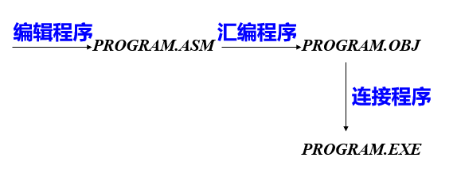
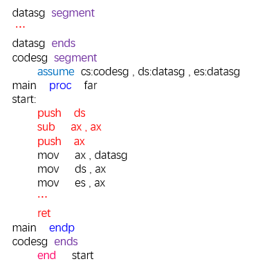
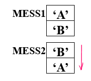
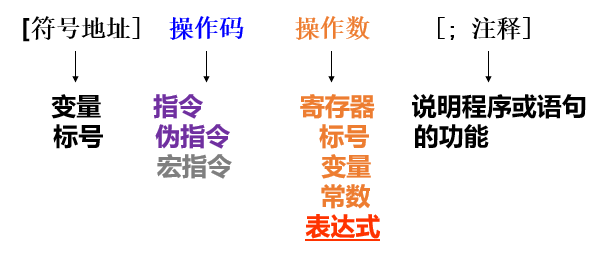

# 汇编程序格式

## 汇编程序功能



## 1. 伪操作

​       **伪操作**是汇编程序对源程序进行汇编时处理的操作，完成数据定义、分配存储区、指示程序开始结束等功能。之前写的汇编程序中，有部分语句属于伪操作，有部分是真正执行期间会执行的。

### a. 处理器选择伪操作

​	默认为8086，如果是其他类型，应当进行指定


### b. 段定义伪操作

```assembly
segment [定位类型,组合类型,使用类型,类别]
	...
ends
; 用户堆栈
stack_seg	segment
		dw		40H	dup(?)	; 最前面没有指定名字，即不保存段首
	tos	label	word		; 接在上面分配空间的段的后面，
							; 这个变量即前面分配的段的尾地址
							; 但是需要声明以字为单位
stack_seg	ends
code_seg	segment
	...
	mov	ax,stack_seg		; 自己设置段寄存器和偏移寄存器
	mov	ss,ax
	mov	sp,offset tos		; 注意offset
	...
code_seg	ends
```

例子，下面红色部分即用于保证ret能够返回到DOS，*end start*标志着masm工作结束的地方，也对应了开始的地方



```assembly
mov	ax,4c00H
int	21H
; 等价于上面的一波操作
```

### c. 存储模型与简化段定义伪指令  

```assembly
.MODEL	SMALL
.STACK	100H
.DATA	
	...
.CODE
start:
	mov	ax, @DATA
	...
```

### d. 数据定义以及存储器分配

```assembly
; 其基本形式是：
[Variable]	Mnemonic	oper,oper...
; Variable 如果有的话，为第一个字节的偏移地址
; Mnemonic: db dw dd df ...
```


```assembly
mess1	db	'AB'
msee2	dw	'AB'
```



```assembly
;label 指明类型，因为没有db这类指令的时候，就无法知道变量指向的单元是按什么长度访问的
b1	label	byte
w1	dw		50 dup(?)	; 这两个变量都指向同一个地方，但是分别按字和字节访问
```


### f. 表达式赋值伪操作

```assembly
const	equ	256
c2		equ	const - 2
; 这类表达式有点像C中的宏，在生成代码的时候相应的位置会用数字直接替代，
; 即数字会存储于代码区
```

### g. 对准伪操作和地址计数$

```assembly
org	<const expr>	
org	100H	; 下面的内容从100H开始存储
even		; 下一地址从偶地址开始
align	boundary	; 使下一地址从指定的倍数开始 boundary必须是4的倍数

; $ 当前正在汇编的指令的地址
org	$+8		; 跳过8个
```

#### h. 基数控制伪操作

```assembly
.RADIX [2,8,10,16]	; 规定接下来无标记数的基数
```

## 汇编语言程序格式



### 表达式操作符

```assembly
; 算数操作符 + - * / mod
A	equ	3
add	ax, A+2
; 逻辑与移位操作符 and or xor not shl shr
opr1	equ	1
opr2	equ	3
and	ax,opr1 and opr2	; 注意这两个and执行时间不同
						; 经过翻译后应当是 and ax,1
; 关系操作符 eq ne lt le gt ge
mov	ax,(offset Y - offset X) le 128	; 偏移是否小于128 -1 真，0 假
; 数值回送操作符
offset / seg <var>
type	;	db	dw	dd	...
		;	1	2	4	...
; 属性操作符
ptr	; 类型
	mov	word ptr [bx],5	;如果不指明类型，则无法判断bx指向的单元作为字还是字节

```

